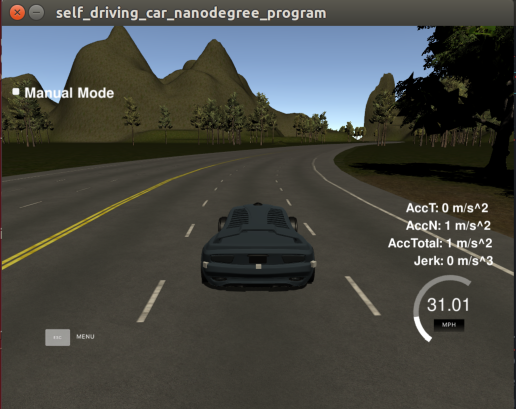
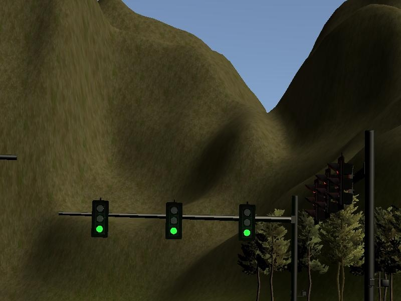
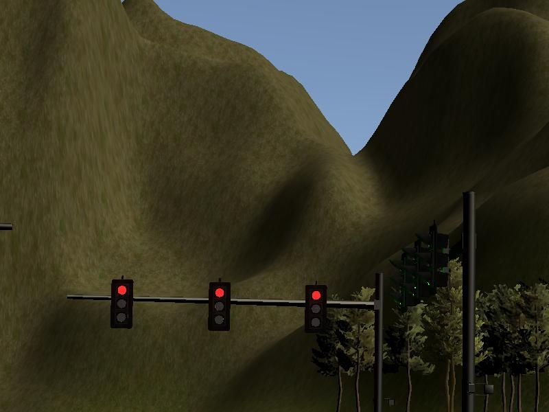
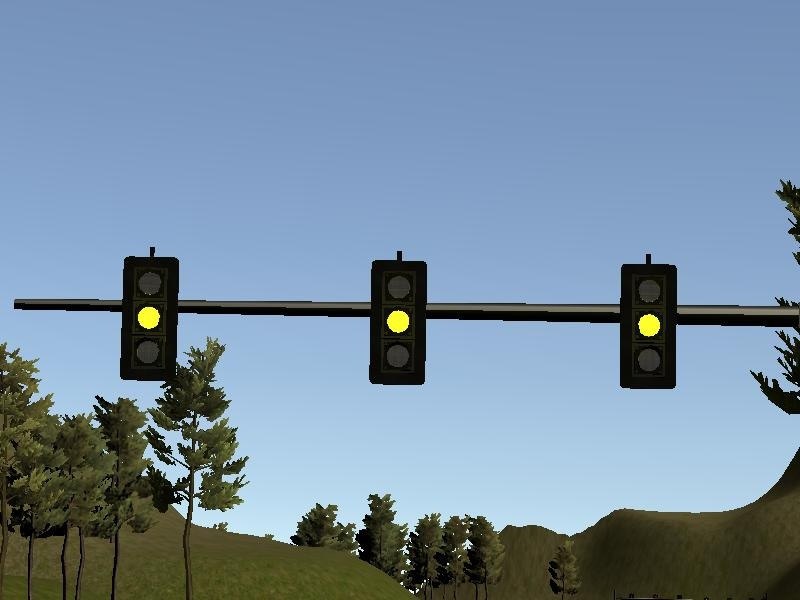
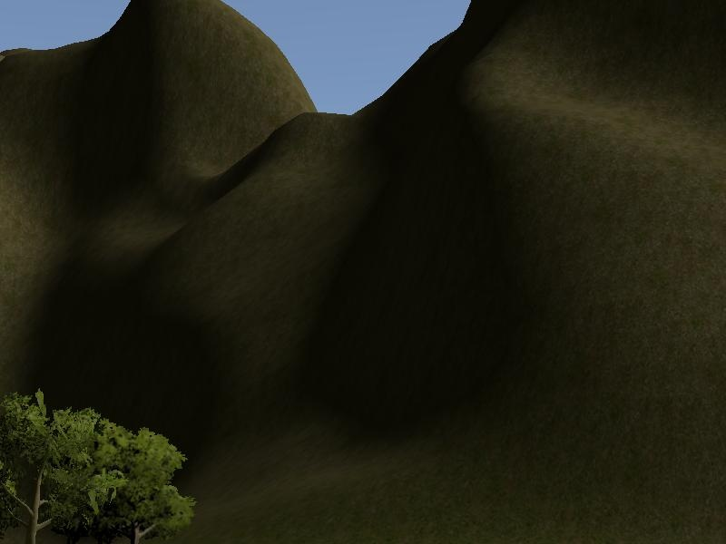

# **Self Driving Car Nanodegree -  System Integration**

## Project objectives
The objective of this project is to implement ROS-based core of an autonomous vehicle. The vehicle shall be able to complete a closed-circuit test-track, detecting the traffic lights and stopping whenever required. 

### **System Integration**

The golas of this project are as below from the project rubric and instruction points:

* goal 1: Smoothly follow waypoints in the simulator.  
* goal 2: Respect the target top speed set for the waypoints' twist.twist.linear.x in waypoint_loader.py. 
* goal 3: Stop at traffic lights when needed.
* goal 4: Stop and restart PID controllers depending on the state of /vehicle/dbw_enabled.
* goal 5: Publish throttle, steering, and brake commands at 50hz.

## Rubric Points:
### Here I considered the [rubric points](https://review.udacity.com/#!/rubrics/1969/view) individually and describe how I addressed each point  in my implementation.

## How to achieve the goals

### ROS Architecture
The autonomous driving system is composed of perception, planning and control. The modules communicate according to the following ROS structure of nodes and topics : 

### Node: Perception

I used a deep learning model,named inception-2015 network, to retrain the traffic light images that saved from the simulator.  To get the training images in the simulator, I use the image_cb in tl_dector.py to save the different light pictures. And in totally, there are about 571 pictures to use in the retraining. The examples of pictures are shown as below:

<table>
<tr>
<td></td>
<td></td>
</tr>
<tr>
<td></td>
<td></td>
</tr>
</table>

### Node: Planning

The objective of the planning module is to specify target speeds based on mission requirements, road map and scene obstacles. In this project the goal is to keep the center lane, respect the speed limit and stop in the red traffic lights. 

The waypoint planner incorporates the information from the traffic light detection node and the base waypoints and the car's pose to form a final waypoint trajectory. The final trajectory is a list of waypoints with target velocities for the car to follow in the control block. 

If any traffic lights are detected the traffic_cb will contain a valid stop line waypoint in front of the vehicle.  If this stopline is within the lookahead distance, a geometric deceleration trajectory is calculated that is ensured not to exceed the maximum accelleration and jerk contraints. If no red traffic lights are detected the planner will simply return the base waypoints to follow within the speed limit.

### Node: Control

Per requirements, the control module must publish throttle, steering angle and brake torque at 50 Hz. To accomplish this, an  yaw controller provides the steering angle that matches the target linear and angular speeds, taking into account the current linear speed of the vehicle.

The linear speed of the vehicle is controlled with a classic digital PID controller. To avoid any kind of aliasing, the speed tracking error is filtered with a single pole low-pass filter and then fed to the controller.

The controller signal is limited to the vehicle acceleration and deceleration limits. If the control command signals acceleration,the value is sent to the throttle as is. To avoid braking overuse and excessive jerk, the control is configured to first stop sending throttle signals and start actively braking the car only if the required force exceeds the brake deadband. Due to the asymptotic nature of PID control, we need to force a full stop with the parking torque of 700 N.m whenever the speed of vehicle falls below a threshold.

### Pipleline or Steps to the goals

Thanks the workthrough in the udacity classroom. There are good guidlines to seperate the project into 2 steps:

* step1: make the system run works without the light dection

* step2: add the light detection and output the final waypoint that combined the base waypoints and the red light waypoints to let the car can stop in front of the red light.

### Build Instructions 

Follow the instruction of the project in the [readme](./README.md)

### Some considerations

During the coding and debug, there will be some obstacles as below:
* The model trained from tensorflow version should be same or compatible with the tensorflow version in the ROS for intereference 
* Should modify the requirements.txt to the correct tensorflow version.
* To get the train data/images, should screenshot of the simulator and save the image to use the dataset. Also should give the correct format of image to the interefernce model in the tl_classifier.py

## Output
As the golas above, the car can be able to complete a closed-circuit test-track, detecting the traffic lights and stopping whenever required in the simulator.

