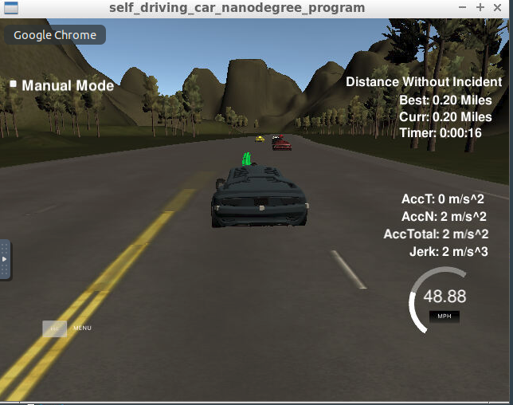
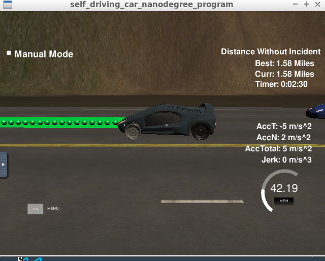
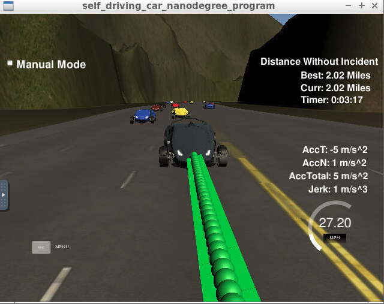
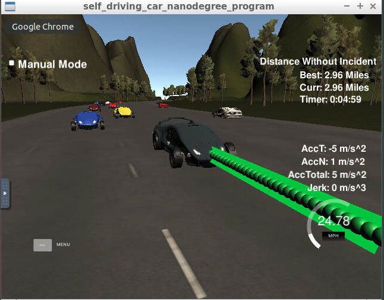

# **Path planning: Highway Driving** 

### The purpose of this project is to design a path planner that is able to create smooth, safe paths for the car to follow along a 3 lane highway with traffic. A successful path planner will be able to keep inside its lane, avoid hitting other cars, and pass slower moving traffic all by using localization, sensor fusion, and map data.

---

**Highway Driving**

The goals of this project are the following from the project rubric points:
* goals 1: The car is able to drive at least 4.32 miles without incident.
* goals 2: The car drives according to the speed limit.
* goals 3: Max Acceleration and Jerk are not Exceeded.
* goals 4: Car does not have collisions.
* goals 5: The car stays in its lane, except for the time between changing lanes.
* goals 6: The car is able to change lanes

## Rubric Points
### Here I considered the [rubric points](https://review.udacity.com/#!/rubrics/1971/view) individually and describe how I addressed each point in my implementation.  

---
### How to achieve the goals

#### 1. Understand the inputs

There are some input data for the path planning as below:
* highway_map.csv: the map data are for the way points that includes x, y, s, dx, dy in global position coordinate system;
* localization: the car's pose data that includes x, y, s, d, yaw and the speed;
* previous path: the previous car's that includes previous_path_x, previous_path_y, end_path_s, and end_path_d;
* sensor fusion data: the obstacle data (other car) from the sensor that includes s, d.

#### 2. Pipeline for the coding

Thanks the project Q&A in this project, it provide more implementaion idea. To achieve the purpose above, the major pipeline are as below:
* 1). Initialize the car and map's data;
* 2). Get and parse the input data from the simulator (Json format) to get the update car's localization, previous path and the fusion data.
* 3). Using sensor fusion to avoid collision(change lanes.. ), coding from line #120 in the main.cpp: 
*     a. get if there is anothe car (obstacle) in the range of the car, left lane, right lane or current lane; and then 
*     b. output the behiviour plan -- change lane, speed +/-.
* 4). Generate the trajectory, coding from line #204 in the main.cpp:
*     a. To have a smooth trajectory, should use the previous path plus the new anchor waypoint from the map to have a spline first.
*     b. Generate the trajectory, using the previous path  and plus the new points that calucated from the spline in the 30m ahead.
* 5). Return the trajecctory to the simulator.

#### 3. Some considerations

There are some import considerations are as below:
* 1). The max limit should around 49.0 equals
* 2). The max acceration should equals 0.224
* 3). the two point in the path should be 0.02ms according the 
* 4). the value of MILES_PER_HOUR should be 2.24
* 5). the coordinate system from simulator is global XY system and the car's system is frenet coordinate system

#### 4. Output screen images

There are some following pictures to show that the project works well and achieve the requirement.

<table>
<tr>
<td></td>
<td></td>
</tr>
<tr>
<td></td>
<td></td>
</tr>
</table>

